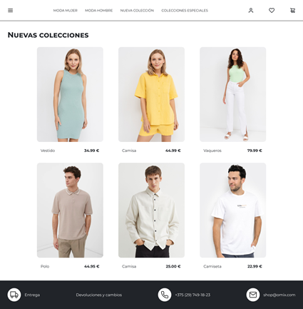
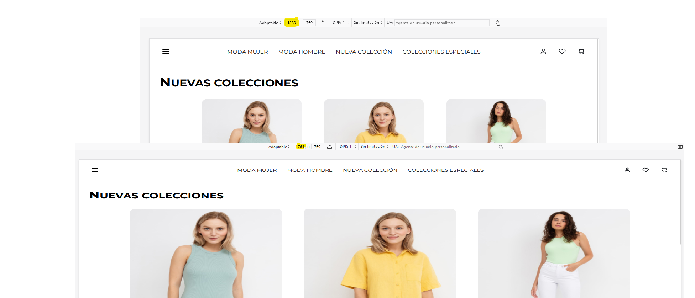
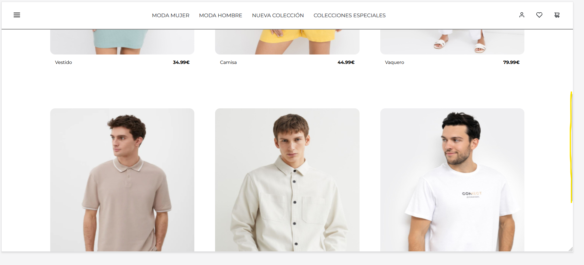
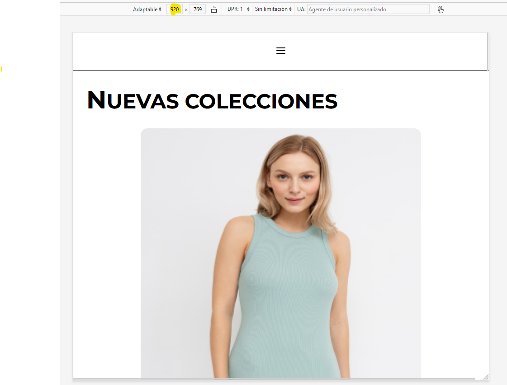
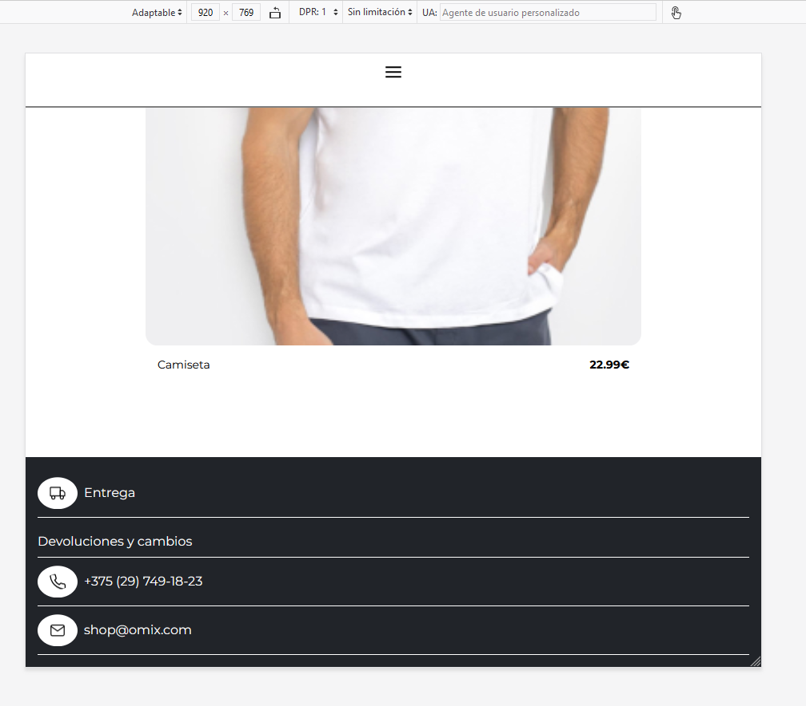

## Laboratorio HTML Beatriz Gonzalez Garcia

<p>El laboratorio consiste en implementar una página web de una tienda de ropa.
El resultado esperado es:</p>



# Material

## Tipografía

<p>Se utilizará la fuente Montserrat de Google Fonts. Para ello la importamos en la hoja de estilos de la siguiente manera:</p>

```CSS
@import url("https://fonts.googleapis.com/css2?family=Montserrat:ital,wght@0,100..900;1,100..900&display=swap");
```

<p>Y la informamos en el selector universal como font-family</p>

```CSS
*{
  box-sizing: border-box;
  margin: 0;
  padding: 0;
  font-family: "Montserrat", sans-serif;
  font-weight: 400;
  font-style: normal;
  font-optical-sizing: auto;
}
```

## Colores

<p>Para los colores usamos dos Custom Properties.</p>

```CSS
:root {
  --negro: #212429;
  --blanco: #ffffff;
}
```

# Apartado obligatorio

<p>Maquetar el contenido principal de la página ( Nuevas colecciones ) haciendo que el contenido se adapte de manera responsiva si el tamaño de pantalla cambia.
Para ello se han utilizado las propiedades display: flex y display:grid </p>



# Apartado opcional

<p>Implementar la pantalla completa con la barra de navegación y el footer</p>

<p> •	La barra de navegación tiene que mantenerse fija al hacer scroll.</p>
<p>Se consigue definiendo la position con sticky</p>

```CSS
header {
  width: 100%;
  position: sticky;
  top: 0;
  left: 0;
  right: 0;
  display: flex;
  justify-content: space-between;
  align-items: center;
  height: 85px;
  padding: 15px 25px;
  border-bottom: 2px solid grey;
  background-color: var(--blanco);
}
```



<p> •	La hoja de estilos tiene que ser definida en un documento .css para ser importada en el documento html.</p>

```HTML
  <head>
    <meta charset="UTF-8" />
    <meta name="viewport" content="width=device-width, initial-scale=1.0" />
    <title>Laboratorio HTML</title>
    <link rel="stylesheet" href="style.css" />
  </head>
```

# Apartado extra

<p>Implementar para la barra de navegación y el pie de página un diseño que se adapte a la pantalla, el diseño es para un ancho máximo de 920px.</p>

<p>Se ha utilizado media query para que para un ancho menor o igual a 920px se muestre en la barra de navegación el icono de la hamburguesa, los productos aparezcan en una única columna y el footer también esté en modo columna</p>

```CSS
@media (max-width: 920px) {
  .productos {
    grid-template-columns: repeat(1, 1fr);
  }
  header .iconos {
    display: none;
  }
  header nav {
    display: none;
  }
  header .menu {
    width: 100%;
    display: flex;
    justify-content: center;
  }
  h1 {
    font-size: 45px;
    width: 100%;
  }
  h1::first-letter {
    font-size: 55px;
  }
  footer .contenedor .fila .columna {
    border-bottom: 1px solid var(--blanco);
  }
  footer .contenedor .fila {
    grid-template-columns: repeat(1, 1fr);
  }
}
```

<p>El resultado para la cabecera es </p>



<p>Y para el footer</p>



# Hover

<p>Se ha añadido en la barra de navegación efectos de cambio de color de letra, tamaño y color de fondo de los iconos. Los productos también aumentan de tamaño al pasar el ratón por encima.</p>
